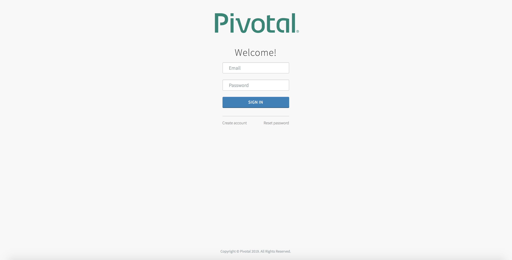
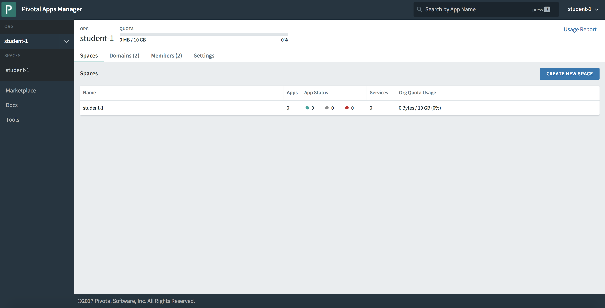

= Lab 0 - Setup the Workshop Environment

[abstract]
--
In this lab we will setup the cf environment
--

Estimated Time: 15 minutes

== Prerequisites
- [Cloud Foundry CLI](https://console.run.pivotal.io/tools)
- [Git Client](https://git-scm.com/downloads)

**Verify the Prerequisites installation**
``` 
$ cf --version
$ git --version 
```

## Getting started

Start by downloading the course materials.  This can be accomplished either through the GitHub website or if you have Git installed, use the following commands:

```
$ git clone https://github.com/shiva-pivotal/pcf-java-workshop.git
$ cd pcf-java-workshop/
$ git fetch --all
```

A few details you'll need to complete the exercises:

  * **API URL for PAS:** `https://api.dev.sys.pcfonemagnify.com` 
  * **API URL for PAS Apps Manager:** [https://apps.dev.sys.pcfonemagnify.com](https://apps.dev.sys.pcfonemagnify.com)
  * **Environment Credentials:** [Google Sheets](https://docs.google.com/spreadsheets/d/1e9knXV2E80-Ef8tXqpXehnRhWRNrEnTlSfJnbaZ6xkw/edit#gid=0)

== CF CLI Target and Log In

. Set the API target for the CLI:
+
----
$ cf api --skip-ssl-validation https://api.dev.sys.pcfonemagnify.com
----

. Login to Pivotal Cloud Foundry:
+
----
$ cf login
----
+
Follow the prompts, entering in the student credentials provided by the instructor and choosing the your space.
+
====
----
> cf login
API endpoint: https://api.dev.sys.pcfonemagnify.com

Email> student-1

Password>
Authenticating...
OK

Targeted org student-1

Targeted space student-1


API endpoint:   https://api.dev.sys.pcfonemagnify.com (API version: 2.112.0)
User:           student-1
Org:            student-1
Space:          student-1

----
====

== AppsManager Log In

. Log In to Apps Manager URL: https://apps.dev.sys.pcfonemagnify.com. Click on the 'LOG IN'link in the upper right corner. Use the same username and password you entered when using the CF CLI
+
  

. Post Log In Screen:

+

