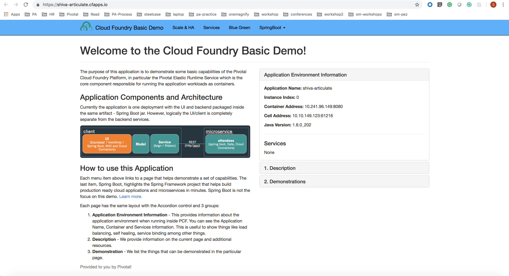

= Lab 1 - Pushing Your First Application

[abstract]
--
The prime directive of Pivotal Cloud Foundry is to host applications. We are going to exercise that directive by pushing a very simple Spring application.

By the end of this lab you should have your attendees application up and running in your account.
--

Estimated Time: 30 minutes

== Download git repo (if not done already)

. Download and clone the git repo, if you have the command line tool installed, or you can click 'Download ZIP' on the right side of the page https://github.com/shiva-pivotal/pcf-java-workshop
+
----
> git clone https://github.com/shiva-pivotal/pcf-java-workshop.git
----

== Navigate to the application directory

. Open a command prompt in Windows (or Terminal on Mac) Navigate to /pcf-java-workshop/deployables/articulate directory
. Open the manifest.yml file in your text editor and update the username to your unique username so that we can differentiate your app from other workshop attendee's app.
For example, below is the name value changes in my manifest.yml file. Remember to preserve the space after _name:_
 
 Previous value:
 name: changeMeToUniqueUsername-articulate
 New value:
 name: shiva-articulate
 
 Complete manifest.yml file :
 
 applications:
- name: shiva-articulate
  path: ./articulate-0.0.1-SNAPSHOT.jar
  instances: 1
  memory: 1024M
  disk_quota: 1024M
  stack: cflinuxfs2

== Target

. If you haven't already, set the API target for the CLI: (set appropriate end point for your environment)
+
----
> cf api https://api.dev.sys.pcfonemagnify.com

Setting api endpoint to https://api.dev.sys.pcfonemagnify.com...
OK

API endpoint:   https://api.dev.sys.pcfonemagnify.com
API version:    2.112.0
----
and login to Pivotal Cloudfoundry:
+
----
> cf login
----
+
Follow the prompts. 

== Push It!

. Push the application from */pcf-java-workshop/deployables/articulate* directory!
+
----
> cf push
----
+
You should see output similar to the following listing. Take a look at the listing callouts for a play-by-play of what's happening:
+
====
----
> cf push
Pushing from manifest to org shiva-pcf-poc / space development as shreddy@pivotal.io...
Using manifest file /Users/shiva/workspace/om-workshop/pcf-java-workshop/deployables/articulate/manifest.yml
Getting app info...
Creating app with these attributes...
+ name:         shiva-articulate
  path:         /Users/shiva/workspace/om-workshop/pcf-java-workshop/deployables/articulate/pcf-ers-demo1-0.0.1-SNAPSHOT.jar
+ disk quota:   1G
+ instances:    1
+ memory:       2G
+ stack:        cflinuxfs2
  routes:
+   shiva-articulate.cfapps.io

Creating app shiva-articulate...
Mapping routes...
Comparing local files to remote cache...
Packaging files to upload...
Uploading files...
 681.36 KiB / 681.36 KiB [================================================================================================================================================================] 100.00% 1s

Waiting for API to complete processing files...

Staging app and tracing logs...
   Downloading dotnet_core_buildpack_beta...
   Downloading dotnet_core_buildpack...
   Downloading python_buildpack...
   Downloading java_buildpack...
   Downloading staticfile_buildpack...
   Downloaded dotnet_core_buildpack_beta
   Downloading nodejs_buildpack...
   Downloaded dotnet_core_buildpack
   Downloading ruby_buildpack...
   Downloaded staticfile_buildpack
   Downloaded java_buildpack
   Downloading go_buildpack...
   Downloaded go_buildpack
   Downloading binary_buildpack...
   Downloaded python_buildpack
   Downloading php_buildpack...
   Downloaded ruby_buildpack
   Downloaded binary_buildpack
   Downloaded php_buildpack
   Downloaded nodejs_buildpack
   Cell 4ae961ca-0fe4-4c10-acc6-cffcd81c918a creating container for instance 98ae801a-e114-4aee-99e2-784053df9b33
   Cell 4ae961ca-0fe4-4c10-acc6-cffcd81c918a successfully created container for instance 98ae801a-e114-4aee-99e2-784053df9b33
   Downloading app package...
   Downloaded app package (34.4M)
   -----> Java Buildpack v4.17.1 (offline) | https://github.com/cloudfoundry/java-buildpack.git#47e68da
   -----> Downloading Jvmkill Agent 1.16.0_RELEASE from https://java-buildpack.cloudfoundry.org/jvmkill/trusty/x86_64/jvmkill-1.16.0_RELEASE.so (found in cache)
   -----> Downloading Open Jdk JRE 1.8.0_202 from https://java-buildpack.cloudfoundry.org/openjdk/trusty/x86_64/openjdk-1.8.0_202.tar.gz (found in cache)
          Expanding Open Jdk JRE to .java-buildpack/open_jdk_jre (1.1s)
          JVM DNS caching disabled in lieu of BOSH DNS caching
   -----> Downloading Open JDK Like Memory Calculator 3.13.0_RELEASE from https://java-buildpack.cloudfoundry.org/memory-calculator/trusty/x86_64/memory-calculator-3.13.0_RELEASE.tar.gz (found in cache)
          Loaded Classes: 17721, Threads: 250
   -----> Downloading Client Certificate Mapper 1.8.0_RELEASE from https://java-buildpack.cloudfoundry.org/client-certificate-mapper/client-certificate-mapper-1.8.0_RELEASE.jar (found in cache)
   -----> Downloading Container Security Provider 1.16.0_RELEASE from https://java-buildpack.cloudfoundry.org/container-security-provider/container-security-provider-1.16.0_RELEASE.jar (found in cache)
   -----> Downloading Spring Auto Reconfiguration 2.5.0_RELEASE from https://java-buildpack.cloudfoundry.org/auto-reconfiguration/auto-reconfiguration-2.5.0_RELEASE.jar (found in cache)
   Exit status 0
   Uploading droplet, build artifacts cache...
   Uploading droplet...
   Uploading build artifacts cache...
   Uploaded build artifacts cache (130B)
   Uploaded droplet (81.1M)
   Uploading complete
   Cell 4ae961ca-0fe4-4c10-acc6-cffcd81c918a stopping instance 98ae801a-e114-4aee-99e2-784053df9b33
   Cell 4ae961ca-0fe4-4c10-acc6-cffcd81c918a destroying container for instance 98ae801a-e114-4aee-99e2-784053df9b33
   Cell 4ae961ca-0fe4-4c10-acc6-cffcd81c918a successfully destroyed container for instance 98ae801a-e114-4aee-99e2-784053df9b33

Waiting for app to start...

name:              shiva-articulate
requested state:   started
routes:            shiva-articulate.cfapps.io
last uploaded:     Tue 15 Jan 20:03:14 EST 2019
stack:             cflinuxfs2
buildpacks:        client-certificate-mapper=1.8.0_RELEASE container-security-provider=1.16.0_RELEASE java-buildpack=v4.17.1-offline-https://github.com/cloudfoundry/java-buildpack.git#47e68da
                   java-main java-opts java-security jvmkill-agent=1.16.0_RELEASE open-jd...

type:            web
instances:       1/1
memory usage:    2048M
start command:   JAVA_OPTS="-agentpath:$PWD/.java-buildpack/open_jdk_jre/bin/jvmkill-1.16.0_RELEASE=printHeapHistogram=1 -Djava.io.tmpdir=$TMPDIR -XX:ActiveProcessorCount=$(nproc)
                 -Djava.ext.dirs=$PWD/.java-buildpack/container_security_provider:$PWD/.java-buildpack/open_jdk_jre/lib/ext
                 -Djava.security.properties=$PWD/.java-buildpack/java_security/java.security $JAVA_OPTS" &&
                 CALCULATED_MEMORY=$($PWD/.java-buildpack/open_jdk_jre/bin/java-buildpack-memory-calculator-3.13.0_RELEASE -totMemory=$MEMORY_LIMIT -loadedClasses=18499 -poolType=metaspace
                 -stackThreads=250 -vmOptions="$JAVA_OPTS") && echo JVM Memory Configuration: $CALCULATED_MEMORY && JAVA_OPTS="$JAVA_OPTS $CALCULATED_MEMORY" && MALLOC_ARENA_MAX=2 SERVER_PORT=$PORT
                 eval exec $PWD/.java-buildpack/open_jdk_jre/bin/java $JAVA_OPTS -cp $PWD/. org.springframework.boot.loader.JarLauncher
     state     since                  cpu      memory         disk           details
#0   running   2019-01-16T01:03:41Z   156.7%   465.9M of 2G   163.9M of 1G

----
<1> The CLI is using a manifest to provide necessary configuration details such as application name, memory to be allocated, the stack to be used (in this case cflinuxfs2), the number of instances requested to start, and path to the application artifact.
Take a look at `manifest.yml` to see how.
<2> In most cases, the CLI indicates each Cloud Foundry API call as it happens.
In this case, the CLI has created an application record for _shiva-articulate_ in the assigned space.
<3> All HTTP/HTTPS requests to applications will flow through Cloud Foundry's front-end router called https://docs.pivotal.io/pivotalcf/1-9/concepts/architecture/router.html[(Go)Router].
Here the CLI is creating a route with your unique application name to prevent route collisions across the default `cfapps.io` domain.
<4> Now the CLI is _binding_ the created route to the application.
Routes can actually be bound to multiple applications to support techniques such as https://docs.pivotal.io/pivotalcf/1-9/devguide/deploy-apps/blue-green.html[blue-green deployments].
<5> The CLI finally uploads the application bits to Pivotal Cloud Foundry. Notice that it's uploading _139 files_! This is because Cloud Foundry actually uploads all the files for the deployment for caching purposes.
<6> Now we begin the staging process. By choosing the cflinuxfs2 stack a container is created on the runtime to prepare the application to run, a second container is then generated that will host your application...in this case using the Tomcat app server in Linux.   
<7> The complete package of your application and all of its necessary runtime components is called a _droplet_.
Here the droplet is being uploaded to Pivotal Cloudfoundry's internal blobstore so that it can be easily copied to one or more Cells in the _https://docs.pivotal.io/pivotalcf/1-9/concepts/diego/diego-architecture.html[Diego Architecture]_ for execution.
<8> The CLI tells you exactly what command and argument set was used to start your application.
<9> Finally the CLI reports the current status of your application's health.
====

. Visit the application in your browser by hitting the route that was generated by the CLI and is accessible in the *urls* section above - in my example, it is https://shiva-articulate.cfapps.io:
+

== Interact with App from CF CLI

. Get information about the currently deployed application using CLI apps command:
+
----
> cf apps
----
+
You should see output similar to the following listing:
+
----
> cf apps
Getting apps in org shiva-pcf-poc / space development as shreddy@pivotal.io...
OK

name                    requested state   instances   memory   disk   urls
shiva-articulate   started           1/1         1G       1G     shiva-articulate.cfapps.io
----
+

Note the application name for next steps

. Get information about running instances, memory, CPU, and other statistics using CLI instances command
+
----
> cf app shiva-articulate
----
+

You should see output similar to the following listing:
+
----
> cf app shiva-articulate
Showing health and status for app shiva-articulate in org shiva-pcf-poc / space development as shreddy@pivotal.io...

name:              shiva-articulate
requested state:   started
routes:            shiva-articulate.cfapps.io
last uploaded:     Tue 15 Jan 20:03:14 EST 2019
stack:             cflinuxfs2
buildpacks:        client-certificate-mapper=1.8.0_RELEASE container-security-provider=1.16.0_RELEASE java-buildpack=v4.17.1-offline-https://github.com/cloudfoundry/java-buildpack.git#47e68da
                   java-main java-opts java-security jvmkill-agent=1.16.0_RELEASE open-jd...

type:           web
instances:      1/1
memory usage:   2048M
     state     since                  cpu    memory         disk           details
#0   running   2019-01-16T01:03:41Z   0.4%   658.6M of 2G   163.9M of 1G

----
+

