= Lab 2 - Scaling, Auto Scaling and Zero Downtime Deployments

[abstract]
--
Pivotal Cloudfoundry makes the work of performing operations actions, such as scaling, doing a zero-downtime deploy, and managing application health very easy.
In the next two labs we'll explore Pivotal Cloud Foundry operations.
--

== Scale Horizontally

=== Scale the Application Out

. Now let's increase the number of running application instances to 3.  :
+
----
> cf scale shiva-articulate -i 3
Scaling app shiva-articulate in org shiva-pcf-poc / space development as shreddy@pivotal.io...
OK

----
+
In reporting `OK`, the CLI is letting you know that the additional requested instances have been started, but they are not yet necessarily running.

. We can determine how many instances are actually running like this:
+
====
----
> cf app shiva-articulate
Showing health and status for app shiva-articulate in org shiva-pcf-poc / space development as shreddy@pivotal.io...

name:              shiva-articulate
requested state:   started
routes:            shiva-articulate.cfapps.io
last uploaded:     Tue 15 Jan 20:03:14 EST 2019
stack:             cflinuxfs2
buildpacks:        client-certificate-mapper=1.8.0_RELEASE container-security-provider=1.16.0_RELEASE java-buildpack=v4.17.1-offline-https://github.com/cloudfoundry/java-buildpack.git#47e68da
                   java-main java-opts java-security jvmkill-agent=1.16.0_RELEASE open-jd...

type:           web
instances:      3/3
memory usage:   2048M
     state     since                  cpu      memory         disk           details
#0   running   2019-01-16T01:03:41Z   0.5%     674.4M of 2G   163.9M of 1G
#1   running   2019-01-16T01:29:17Z   0.6%     695.7M of 2G   163.9M of 1G
#2   running   2019-01-16T01:29:30Z   131.1%   663M of 2G     163.9M of 1G
>
----
====

. Revisit the application route in the browser.
Refresh several times.
You should observe the instance index changing as you do so:
+
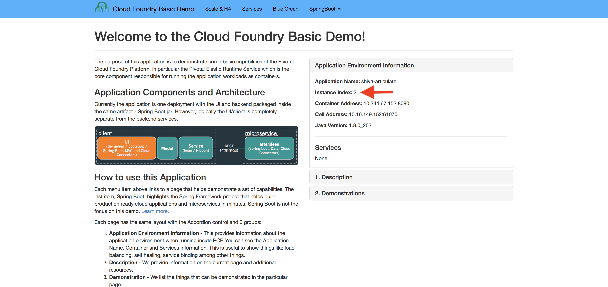
+
The aforementioned https://docs.pivotal.io/pivotalcf/1-7/concepts/architecture/router.html[(Go)Router] is applying a random routing algorithm to all of the application instances assigned to this route.
As an instance reaches the `running` state, its https://docs.pivotal.io/pivotalcf/1-9/concepts/diego/diego-architecture.html#architecture[Diego] Cell registers that instance in the routing table assigned to its route by sending a message to Cloud Foundry's message bus.
All (Go)Router instances are subscribed to this channel and register the routes independently.
This makes for very dynamic and rapid reconfiguration!

=== Scale the Application In

. We can scale the application instances back down as easily as we scaled them up, using the same command structure:
+
----
> cf scale shiva-articulate -i 1
Scaling app shiva-articulate in org shiva-pcf-poc / space development as shreddy@pivotal.io...
OK

----

. Check the application status again:
+
----
> cf app shiva-articulate
Showing health and status for app shiva-articulate in org shiva-pcf-poc / space development as shreddy@pivotal.io...

name:              shiva-articulate
requested state:   started
routes:            shiva-articulate.cfapps.io
last uploaded:     Tue 15 Jan 20:03:14 EST 2019
stack:             cflinuxfs2
buildpacks:        client-certificate-mapper=1.8.0_RELEASE container-security-provider=1.16.0_RELEASE java-buildpack=v4.17.1-offline-https://github.com/cloudfoundry/java-buildpack.git#47e68da
                   java-main java-opts java-security jvmkill-agent=1.16.0_RELEASE open-jd...

type:           web
instances:      1/1
memory usage:   2048M
     state     since                  cpu    memory         disk           details
#0   running   2019-01-16T01:03:41Z   0.5%   676.2M of 2G   163.9M of 1G
----
+
As you can see, we're back down to only one instance running, and it is in fact the original index 0 that we started with.

. Confirm that by again revisiting the route in the browser and checking the instance index:
+
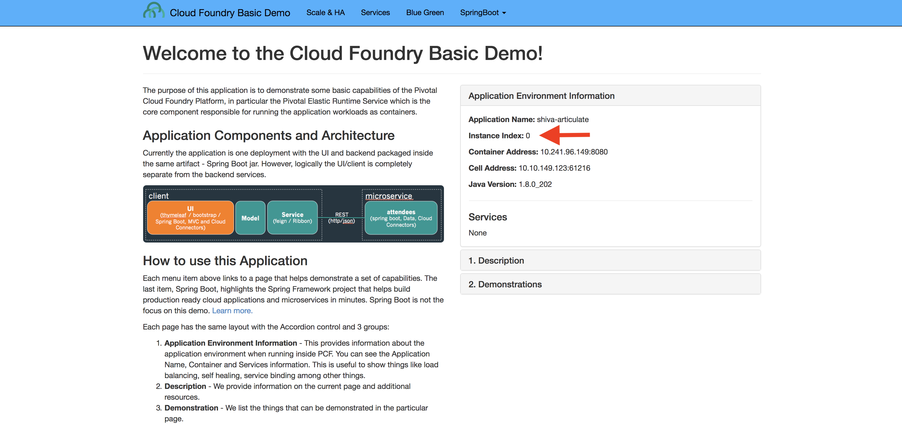

== Scale Vertically

=== Scale the Application Up 

. Now let's increase the memory of application to 2G.  :
+
----
> cf scale shiva-articulate -m 2G

This will cause the app to restart. Are you sure you want to scale shiva-articulate?> y

Scaling app shiva-articulate in org shiva-pcf-poc / space development as shreddy@pivotal.io...
OK
Stopping app shiva-articulate in org shiva-pcf-poc / space development as shreddy@pivotal.io...
OK

Starting app shiva-articulate in org shiva-pcf-poc / space development as shreddy@pivotal.io...

0 of 1 instances running, 1 starting
0 of 1 instances running, 1 starting
0 of 1 instances running, 1 starting
0 of 1 instances running, 1 starting
1 of 1 instances running

App started

OK

App shiva-articulate was started using this command `JAVA_OPTS="-agentpath:$PWD/.java-buildpack/open_jdk_jre/bin/jvmkill-1.16.0_RELEASE=printHeapHistogram=1 -Djava.io.tmpdir=$TMPDIR -XX:ActiveProcessorCount=$(nproc) -Djava.ext.dirs=$PWD/.java-buildpack/container_security_provider:$PWD/.java-buildpack/open_jdk_jre/lib/ext -Djava.security.properties=$PWD/.java-buildpack/java_security/java.security $JAVA_OPTS" && CALCULATED_MEMORY=$($PWD/.java-buildpack/open_jdk_jre/bin/java-buildpack-memory-calculator-3.13.0_RELEASE -totMemory=$MEMORY_LIMIT -loadedClasses=18499 -poolType=metaspace -stackThreads=250 -vmOptions="$JAVA_OPTS") && echo JVM Memory Configuration: $CALCULATED_MEMORY && JAVA_OPTS="$JAVA_OPTS $CALCULATED_MEMORY" && MALLOC_ARENA_MAX=2 SERVER_PORT=$PORT eval exec $PWD/.java-buildpack/open_jdk_jre/bin/java $JAVA_OPTS -cp $PWD/. org.springframework.boot.loader.JarLauncher`

Showing health and status for app shiva-articulate in org shiva-pcf-poc / space development as shreddy@pivotal.io...
OK

requested state: started
instances: 1/1
usage: 2G x 1 instances
urls: shiva-articulate.cfapps.io
last uploaded: Wed Jan 16 01:02:42 UTC 2019
stack: cflinuxfs2
buildpack: client-certificate-mapper=1.8.0_RELEASE container-security-provider=1.16.0_RELEASE java-buildpack=v4.17.1-offline-https://github.com/cloudfoundry/java-buildpack.git#47e68da java-main java-opts java-security jvmkill-agent=1.16.0_RELEASE open-jd...

     state     since                    cpu      memory         disk           details
#0   running   2019-01-15 09:10:45 PM   219.3%   578.2M of 2G   163.9M of 1G
>
----

=== Scale the Application Down

. We can scale the application memory back down as easily as we scaled them up, using the same command structure:
+
----
> cf scale shiva-articulate -m 1G
Scaling app shiva-articulate in org shiva-pcf-poc / space development as shreddy@pivotal.io...
OK
----

=== Questions

* How long does it take to scale up or out applications now?

== Auto Scaling

As you have seen it is pretty easy to scale up or down using the cf CLI or Apps Manager, but there are times when you would like the app to auto scale based on some pre-determined conditions. Let us walk through the steps where your application will take advantage of the Auto Scaler service.

. Navigate to https://apps.dev.sys.pcfonemagnify.com and Log in, if redirected to login screen. 
. After login, click on the 'Marketplace' link on the left hand menu option as shown in the image below:
+
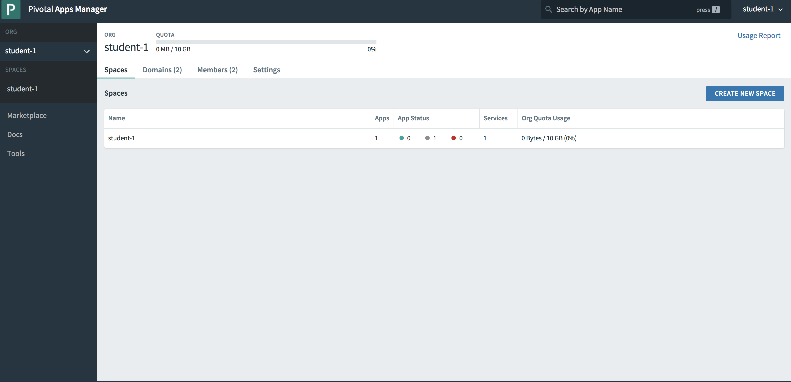

. Click on App Autoscaler and you will see a screen similar to the one below. 
+ 
image::../../Common/images/autoscaler.png[]

. Click on 'Select this plan' and fill in the following details: give a unique name in the 'Instance Name' field. The Add to Space will be auto-populated with the 'workshop' space. Choose your articulate application from the 'Bind to App' dropdown. Click on 'Add' to create an instance of App autoscaler and bind it to your app.
+ 
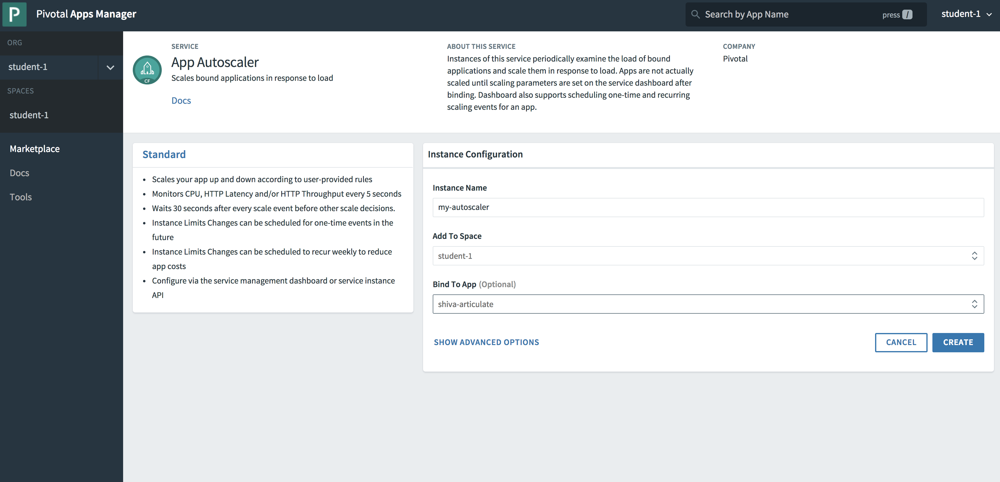

. After the auto scaler service is successfully created and bound to your app, you would be taken to the following service screen:
+ 
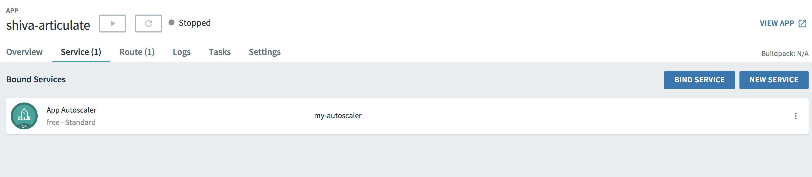

. Click on the App Autoscaler service and you will go into the details page. Click on the 'Manage' link as shown below:
+ 
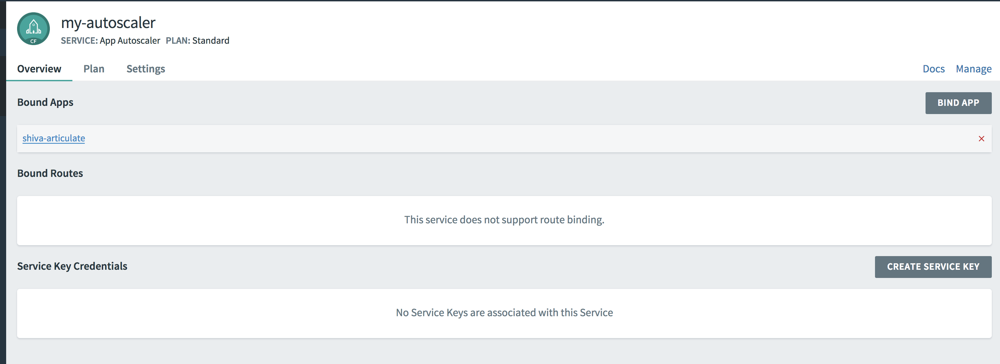

. This will open the Autoscaler dashboard. Click on 'Instance Limits' edit link and enter 2 for Minimum and 5 for Maximum. Hit Save.
+ 
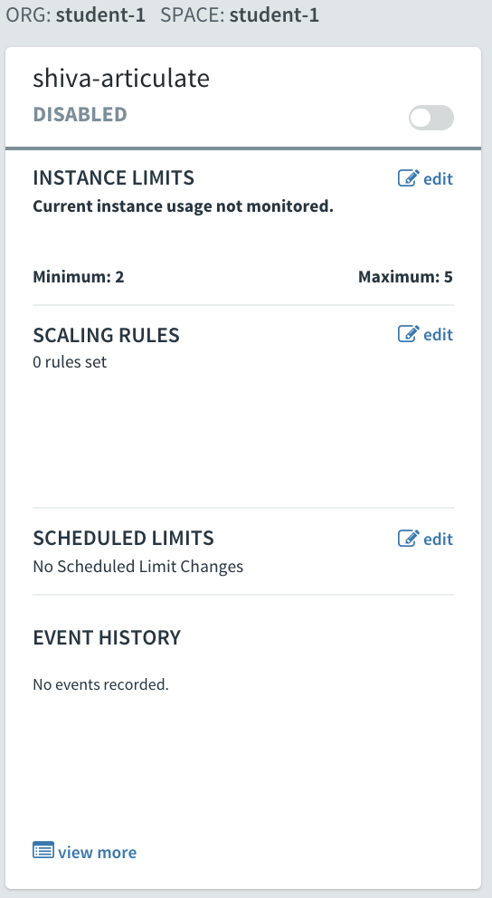

. Click on the toggle button to Enable Autoscaler for your articulate app. 
+ 
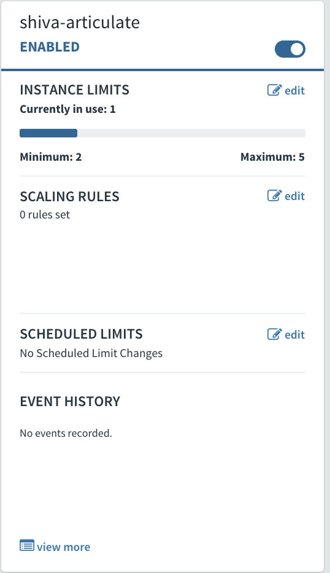

. Going back to App Manager and clicking on your articulate app, you will notice that within 30 odd seconds or less, your app will get automatically auto-scaled to two instances. 
+ 
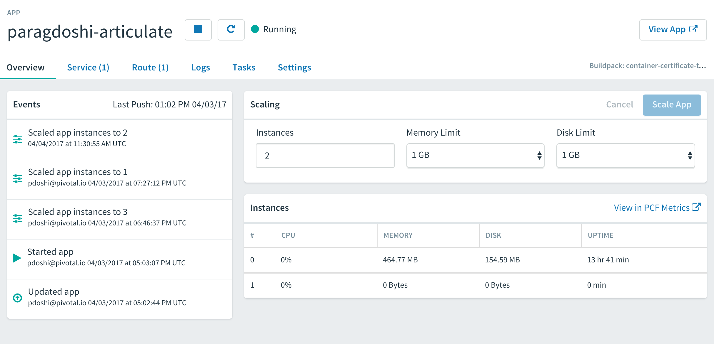

== Zero Downtime Deployment

For this lab, we will simulate a zero downtime deployment by using Routes and deploying the same articulate application and diverting traffic from one app to another.

. When you navigate to your app in App Manager and click on 'Route' link, you will see that your app is bound to one Route which is in the appname.domainname format.
+
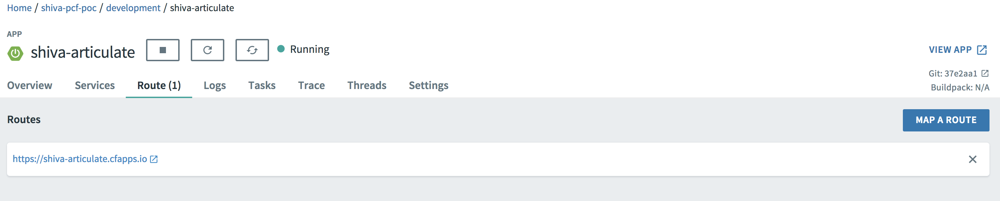

. When you click on your app's route, it opens the app in a new window. Click on the Blue-Green menu option at the top and 'start' the simulation. This will send requests to the route and show which app is servicing the request for that route. As can be seen below, all requests are serviced by the articulate instance of your app.
+
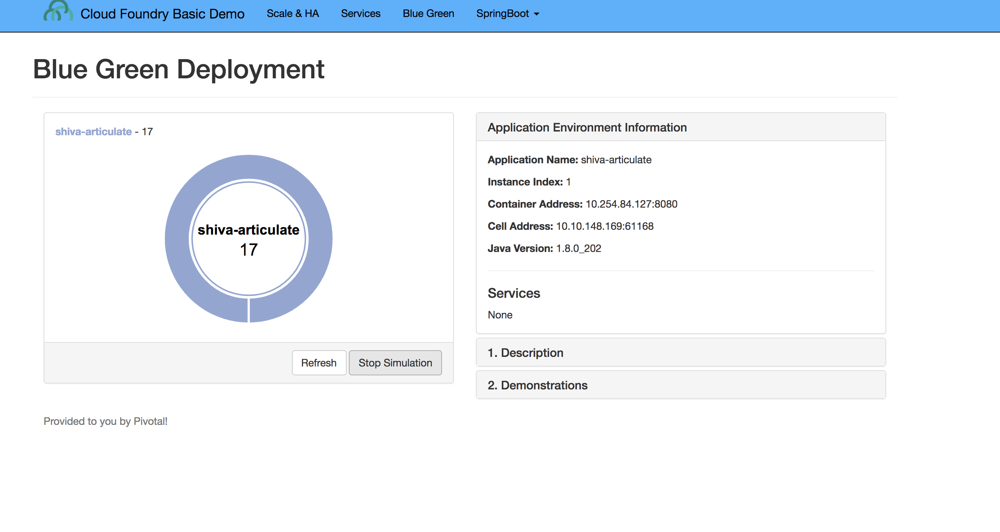

. In the command line window navigate to the /deployables/articulate directory, we will push the same articulate app but with a different name (add a -v2 at the end of the name). It will be assigned a default route in the format appname.domainname.
+
----
> cf push paragdoshi-articulate-v2
----
+

. When you navigate to the App Manager, you will see two articulate apps but with different routes. In a blue-green deployment, v2 is the newer version of your app that you want to release to the world. 
+
image::../../Common/images/same-apps-diff-routes.png[]

. When you click on the v2 articulate app link, it will take you to the articulate app instance that is servicing that particular route. In App Manager, add an additional route to v2 version of the app. This additional route will be the same route as serviced by the first articulate app. In essence, we are trying to divert some amount of traffic to the newer version of the apps and the remaining traffic to the older version of the app. Click on the 'Route' link for the v2 app and click on 'Map a Route' button. In the text field, enter the host (sub-domain) of your previous application - in my case, it is paragdoshi-articulate. The domain name is available as a dropdown value on the screen. After adding another route, you will see something simiar to below:

+
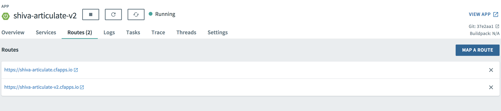

. Now, navigate back to your earlier articulate app, click on the Blue-Green link and if the simulation is still going on - click on Reset button and then hit 'Start'. You will notice that now the traffic is split between the two apps. The original app gets 2/3 of the traffic while the v2 app gets 1/3. Why? Because you have two instances running of the previous articulate app and one instance of v2 of the app.

+
image::../../Common/images/shared-traffic.png[]

. Navigate to App Manager, scale up an additional instance of v2 articulate app and scale down one instance of the previous articulate app. Go back to the articulate app, hit 'Reset' and then hit 'Start'. Now you should see 2/3 of the traffic diverted to v2 of the app and 1/3 of the traffic diverted to previous version of app.
+
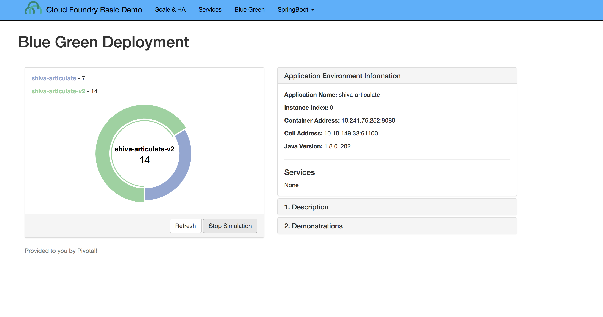

. Finally, navigate to App Manager and go to the previous articulate app, click on Routes and click on the red 'x' to remove the route. After removing the route, your previous app is now inaccessible to any user traffic.

+
image::../../Common/images/removed-route.png[]

. Go back to the articulate app and hit 'Reset' and then hit 'Start'. You will see that all traffic is now serviced by v2 of the app. You have successfully completed a zero downtime deployment!
+
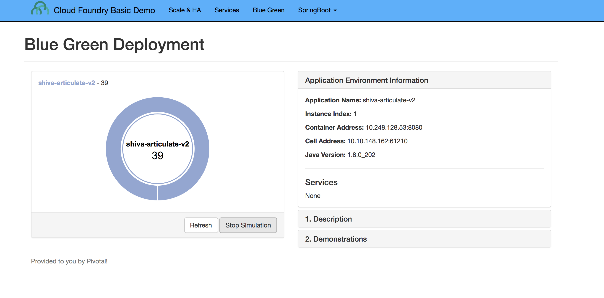

*Congratulations!* You performed a blue-green deployment.

=== Questions
* How would a rollback situation be handled using a blue-green deployment?
* What other design implications does running at least two versions at the same time have on your applications?
* Do you do blue-green deployments today? How is this different?

== Clean Up

. Delete the v2 articulate app - Navigate to v2 articulate app and click on 'Settings'. Scroll down to the end of the page and there will be a 'Delete App' button. Click on it, re-confirm the delete and this will delete v2 articulate app.

. Re-add the orgiinal route back to your previous articulate app so that it is again accessible with that route. In my case, the route name was shiva-articulate. Click on the route and make sure your app is accessible again.
